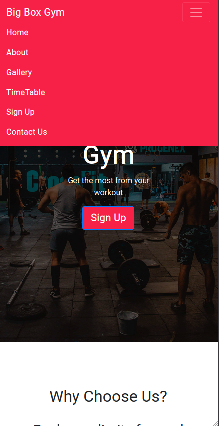
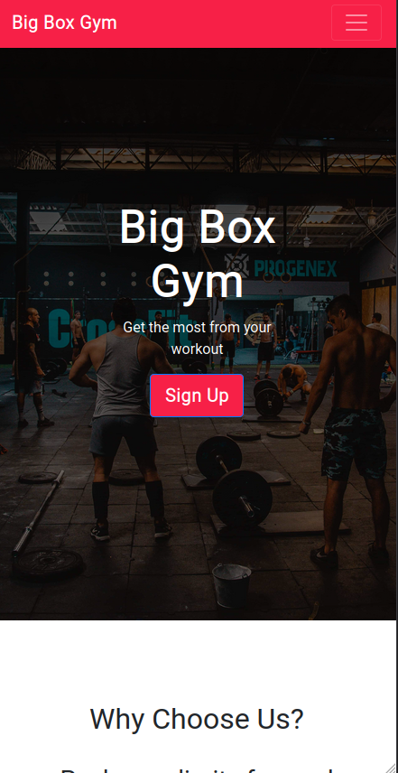
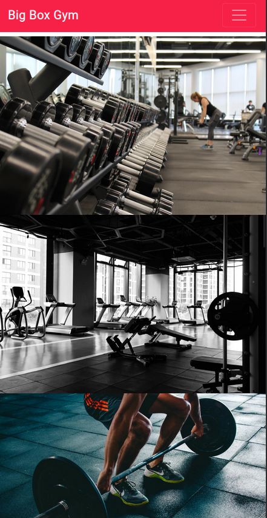
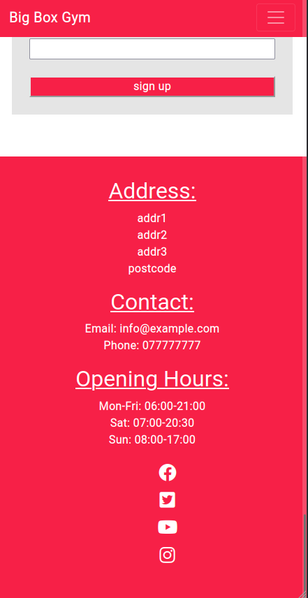

# Welcome to big box gym

A site for a ficticious gym called big box gym. 
View live site here: [Live Site](https://am505.github.io/CSS-HTMLProject/)

## User Experience (UX)
  
### User stories

#### Potential Member Goals
* As a potential member, I want to be able to easily be able to navigate throughout the site to find content.
* As a potential member, I can view photos of the gym, so that I can get a feel for the gym before joining.
* As a potential member, I can view the gym's location, hours of operation, and contact information, so that I can plan my visits accordingly.

#### Gym Member Goals
* As a gym member, I can view my workout class timetable, so that I can plan my visits to the gym effectively.
* As a gym member, I can view the gym's location, hours of operation, and contact information, so that I can plan my visits accordingly.

## Design of the website
The website is designed as one page with links to the septate sections in the nav bar. It also has a link to the sign up section in the hero image. 
 
### Wireframes

The wireframes from the initial design phase can be seen here.

* [desktop](assets/wireframes/desktopWireframe.png)
* [mobile](assets/wireframes/MobileWireframe.png)
* [tablet](assets/wireframes/TabletWireframe.png)

### Fonts and Colour Scheme
The colour scheme is pale red () with white () text and pale grey for contrast in certain areas. 
The Roboto font was used througout the project.

### Images
All images are from the site [https://unsplash.com/](https://unsplash.com/).
Images were resized to all have the same aspect ratio, so they tessilate in a grid pattern.


### Features

#### Navbar
* From the bootstrap navbar class
* Uses the bootstrap toggler, so the navbar collapses to a menu button at small screen sizes.
* Links to relevant sections of page and top of page.

#### Hero Image
* Hero image used to draw user attention and a call to action. 
* Button links to sign up form
* Hero image design and code used from W3 schools tutorial



#### Gallery
* Essential for the user to get a feel for the gym.
* Layed out using bootstrap grid to help with formatting and responsiveness.


#### Timetable 
* Allow users to see what classes are occuring and when.
* Created using responsive css grid.


#### Sign up
* A simple form asking for name and email adderess. 
* User sign up form to try to convert web-traffic into members.


### Languages Used
*  HTML5
* CSS3

### Frameworks, Libraries & Tools
* [Bootstrap 4:](https://getbootstrap.com/) For styling and responsive layout. 
* [jQuery](https://jquery.com/) came with Bootstrap to make the navbar responsive.
* [Google Fonts:](https://fonts.google.com/) Google fonts were used for the 'Roboto' font.
* [Git](https://git-scm.com/) Git was used for version control commit to Git and Push to GitHub.
* [GitHub:](https://github.com/) GitHub is used to store the projects code after being pushed from Git.
* [Balsamiq:](https://balsamiq.com/) Balsamiq was used to create the wireframes during the design process.
* [Fontawesome:](https://fontawesome.com/) Font awesome was used for the why choose us section icons.
    
## Testing 

### User Stories Testing

#### Potential Member Goals

1. As a potential member, I want to be able to easily be able to navigate throughout the site to find content
    * user initially greeted with hero image and nav bar. Hero image attention grabbing and calls on user to sign up 
    * Nav bar contains links to all main sections of site. Allowing the user to quickly navigate.
    * Nav bar stays on top meing user will never have to scroll up to navigate.

1.  As a potential member, I can view photos of the gym, so that I can get a feel for the gym before joining.
    * Images displayed in clear and responsive css grid. 

1.  As a potential member, I can view the gym's location, hours of operation, and contact information, so that I can plan my visits accordingly.
    * All contact information, hours of operation and location in footer of the main page.
    * contact us link in nav bar.

#### Gym Member Goals

1. As a gym member, I can view my workout class timetable, so that I can plan my visits to the gym effectively.
    * Timetable is featured in nav bar to allow user to quickly navigate to it. 
    * Timetable is responsice to allow easy reading on any device.

1. As a gym member, I can view the gym's location, hours of operation, and contact information, so that I can plan my visits accordingly.
    * All contact information, hours of operation and location in footer of the main page.
    * contact us link in nav bar.

### Validation

* [HTML Validator](https://validator.w3.org/) was used to validate html during the project.
* [CSS Validator](https://validator.w3.org/) was used to validate css during the project.


### Responsiveness
Responsiveness was tested using firefox developer tools "Responsive Design Mode".
The site was also tested on firefox and chrome browsers on desktop and mobile. Unfortunatly was not able to test on safari. 


### Accessabiltiy

This site was used to check accessibility: 
[https://webaim.org/resources/contrastchecker/](https://webaim.org/resources/contrastchecker/)
 Along with firefox's accesibiltiy tools.

### GitHub Pages

To deploy to github pages follow these steps:

1. Log in to GitHub and locate the [GitHub Repository](https://github.com/)
2. At the top of the Repository (not top of page), locate the "Settings" Button on the menu.
    - Alternatively Click [Here](https://raw.githubusercontent.com/) for a GIF demonstrating the process starting from Step 2.
3. Scroll down the Settings page until you locate the "GitHub Pages" Section.
4. Under "Source", click the dropdown called "None" and select "Master Branch".
5. The page will automatically refresh.
6. Scroll back down through the page to locate the now published site [link](https://github.com) in the "GitHub Pages" section.


### Forking the GitHub Repository

By forking the GitHub Repository we make a copy of the original repository on our GitHub account to view and/or make changes without affecting the original repository by using the following steps...

1. Log in to GitHub and locate the [GitHub Repository](https://github.com/)
2. At the top of the Repository (not top of page) just above the "Settings" Button on the menu, locate the "Fork" Button.
3. You should now have a copy of the original repository in your GitHub account.

### Making a Local Clone

1. Log in to GitHub and locate the [GitHub Repository](https://github.com/)
2. Under the repository name, click "Clone or download".
3. To clone the repository using HTTPS, under "Clone with HTTPS", copy the link.
4. Open Git Bash
5. Change the current working directory to the location where you want the cloned directory to be made.
6. Type `git clone`, and then paste the URL you copied in Step 3.

```
$ git clone https://github.com/YOUR-USERNAME/YOUR-REPOSITORY
```

7. Press Enter. Your local clone will be created.

```
$ git clone https://github.com/YOUR-USERNAME/YOUR-REPOSITORY
> Cloning into `1000Words-Clone`...
> remote: Counting objects: 10, done.
> remote: Compressing objects: 100% (8/8), done.
> remove: Total 10 (delta 1), reused 10 (delta 1)
> Unpacking objects: 100% (10/10), done.
```

Click [Here](https://help.github.com/en/github/creating-cloning-and-archiving-repositories/cloning-a-repository#cloning-a-repository-to-github-desktop) to retrieve pictures for some of the buttons and more detailed explanations of the above process.

## Credits

### Code
* [bootstrap 4](https://getbootstrap.com/) for styling and responsive layouts
* [w3scools](https://www.w3schools.com/howto/howto_css_hero_image.asp) for code on hero image.

### Content

* Framework of readme from [code institute github](https://github.com/Code-Institute-Solutions/SampleREADME)

### Media

* All images used in the site from [unsplash](https://unsplash.com/)


### Acknowledgements
* My Mentor for continuous helpful feedback.
* Tutor support at Code Institute for their support.
